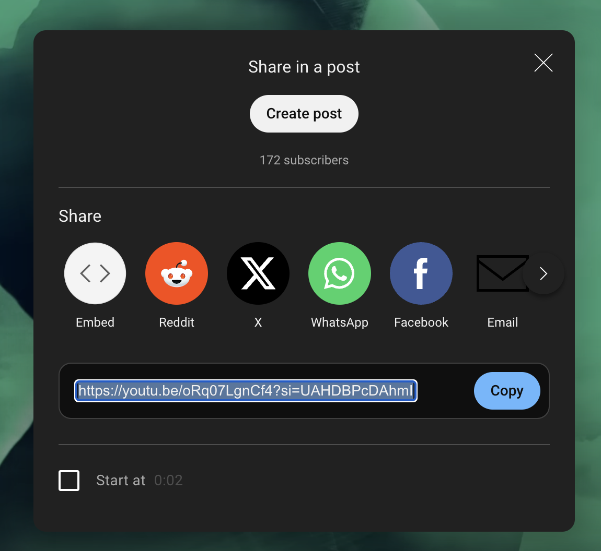

# EasyStems: YouTube Audio Downloader with Stem Separation

## Overview
EasyStems is a simple graphical user interface (GUI) application built using `customtkinter`, `yt-dlp`, and `Demucs` to download audio from YouTube videos and separate stems (vocals, instruments, etc.). It has an easy-to-use interface for downloading audio and processing it for stem separation, all in one streamlined workflow.

## How to Use
### Copy Youtube Link

### Paste Link into EasyStems

### Wait for download to complete and set path

### Wait for stems folder created on Desktop to be downloaded

## Features
- Download high-quality audio from YouTube videos.
- Extract audio in `.wav` format using `yt-dlp`.
- Automatically separates audio into stems (vocals, drums, bass, and more) using `Demucs`.
- Easy-to-use interface with progress tracking and status updates.
- Save stems to a chosen location on your desktop.

## Prerequisites
- Python 3.7+
- Required Python packages:
  - `customtkinter`
  - `yt-dlp`
- External tools:
  - `ffmpeg` for audio extraction (can be installed from [FFmpeg.org](https://ffmpeg.org/download.html)).
  - `Demucs` for stem separation (can be installed following the instructions from [Demucs GitHub](https://github.com/facebookresearch/demucs)).

## Installation

1. Clone the repository or download the code.
2. Install the required Python packages, (I reccomend first downloading Anaconda, and using homebrew for ffmpeg)

